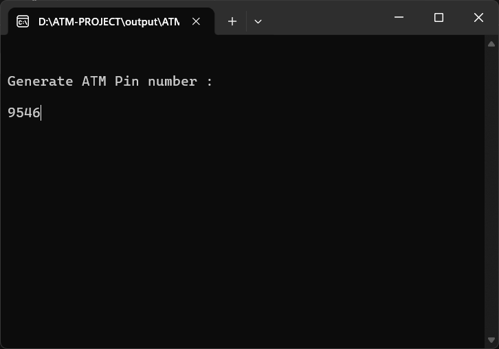
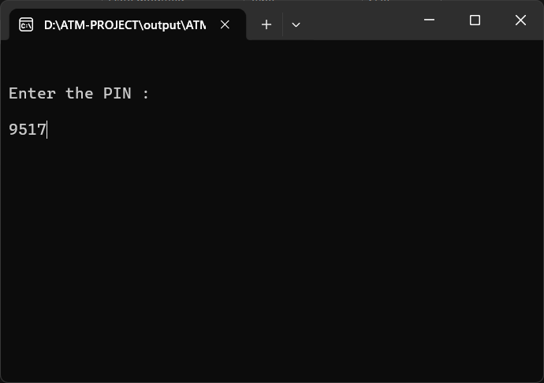
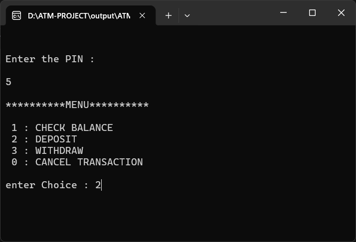
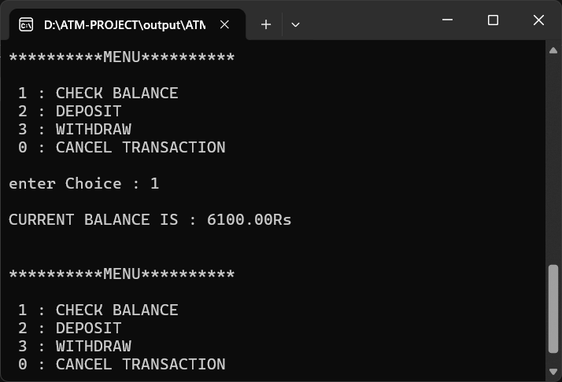
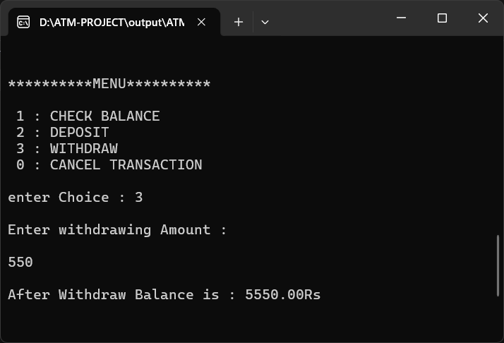

# ATM System

A simple and interactive Automated Teller Machine (ATM) system implemented in C. This educational project demonstrates fundamental banking operations with PIN-based authentication, balance checking, deposits, and withdrawals.

---

## 🎯 Features

- **PIN Generation & Verification**: Generate a 4-digit PIN and use it to authenticate access to your account
- **PIN Security**: Account gets blocked after 3 failed PIN attempts
- **Check Balance**: View your current account balance at any time
- **Deposit Money**: Add funds to your account with input validation
- **Withdraw Money**: Withdraw cash with automatic balance validation
- **Interactive Menu**: User-friendly menu-driven interface with multiple transaction options
- **Input Validation**: Validates deposits and withdrawals to prevent invalid amounts

---

## 📋 How It Works

1. **PIN Generation Phase**: Program asks you to generate a 4-digit PIN
2. **Authentication**: You must enter the correct PIN to access your account
3. **Security Lock**: After 3 wrong PIN attempts, your card gets blocked
4. **Menu Selection**: Choose from 4 options to perform transactions
5. **Transaction Processing**: Each transaction is processed with validation checks

---

## 🖼️ Screenshots

<p align="center">
  
</p>

<p align="center">
  
</p>

<p align="center">
  
</p>

<p align="center">
  
</p>

<p align="center">
  
</p>

---

## 🚀 Getting Started

### Prerequisites

- **C Compiler**: GCC, Clang, or any standard C compiler
- **Text Editor**: To view/edit the source code (optional)
- **Terminal/Command Prompt**: To compile and run the program

### Installation & Running

#### Step 1: Clone the Repository

```bash
git clone https://github.com/Aditya24Rathore/ATM-PROJECT.git
cd ATM-PROJECT
```

#### Step 2: Compile the Program

Using GCC:
```bash
gcc ATM.c -o ATM
```

Or simply:
```bash
gcc ATM.c
```
This will create an executable `a.out` (Linux/Mac) or `ATM.exe` (Windows)

#### Step 3: Run the Program

**On Linux/Mac:**
```bash
./ATM
# or if compiled without -o flag:
./a.out
```

**On Windows:**
```cmd
ATM.exe
# or
a.exe
```

---

## 💻 Usage Guide

### Step-by-Step Instructions

1. **Run the program** using one of the commands above
2. **Generate PIN**: Enter a 4-digit number when prompted
   ```
   Generate ATM Pin number: 1234
   ```
3. **Clear Screen**: Program clears and prompts for PIN entry (educational purpose)
4. **Enter PIN**: Type the PIN you just created
   ```
   Enter the PIN: 1234
   ```
5. **PIN Verification**: System verifies your PIN
   - ✅ If correct → Access granted, menu appears
   - ❌ If wrong → "Invalid PIN" message (max 3 attempts)

6. **Select Transaction**: Choose from menu options
   ```
   **********MENU**********
   
   1 : CHECK BALANCE
   2 : DEPOSIT
   3 : WITHDRAW
   0 : CANCEL TRANSACTION
   
   enter Choice: [Your choice]
   ```

7. **Complete Transaction**: Follow prompts based on your choice

8. **Exit**: Enter `0` to cancel transaction and exit

### Transaction Examples

**Check Balance:**
```
Choice: 1
CURRENT BALANCE IS: 0.00 Rs
```

**Deposit Money:**
```
Choice: 2
Enter Depositing balance: 5000
5000.00 Rs DEPOSITED
```

**Withdraw Money:**
```
Choice: 3
Enter withdrawing Amount: 2000
After Withdraw Balance is: 3000.00 Rs
```

---

## 📁 Project Structure

```
ATM-PROJECT/
├── ATM.c                 # Main source code
├── README.md             # Project documentation
├── LICENSE.md            # MIT License file
├── images/               # Screenshots
│   ├── GeneratePin.png
│   ├── EnterPin.png
│   ├── Deposit.png
│   ├── CheckBalance.png
│   └── Withdraw.png
└── output/               # Compiled executable output
```

---

## 🔍 Code Overview

### Key Functions

| Function | Purpose |
|----------|---------|
| `Gen_Pin()` | Takes PIN input from user during initialization |
| `PIN()` | Takes PIN input during authentication phase |
| `CheckBalance()` | Displays current account balance |
| `Deposit()` | Handles deposit transactions with validation |
| `Withdraw()` | Handles withdrawals with balance checking |
| `main()` | Controls program flow and menu system |

### Global Variable

- `amt` (double): Stores the current account balance (initialized to 0.00)

### Program Flow

1. Generate PIN → Clear Screen → Enter PIN → Validate (max 3 attempts)
2. If validation fails after 3 attempts → Card Blocked → Exit
3. If validation succeeds → Display Menu → Process User Choice
4. Repeat menu until user enters 0 (Cancel Transaction)

---

## ⚠️ Important Notes

### Input Validation Rules

- **Deposit**: Must be greater than 0
- **Withdrawal**: Must be greater than 0 AND less than or equal to current balance
- **PIN**: Any 4-digit number (no validation on digit count in code)
- **Wrong Amount**: Shows "Wrong Amount" or "LOW BALANCE... *OR* INVALID INPUT..."

### Card Lock Feature

- System tracks failed PIN attempts
- After 3 failed attempts → "Card Blocked!" message → Program exits
- No option to unlock card (would require restart)

### Initial Balance

- Program starts with 0.00 Rs balance
- Balance increases/decreases with deposits/withdrawals
- Balance persists only during current program execution

### Currency

- All amounts are in **Indian Rupees (Rs)**
- Uses `%.2f` format for displaying decimal values

---

## 🛠️ Technologies Used

| Technology | Purpose |
|-----------|---------|
| **C Language** | Core programming language |
| **stdio.h** | Standard Input/Output operations |
| **stdlib.h** | System command (system("cls")) |

### Key C Concepts Used

- Functions with return types
- Function parameters
- Switch-case statements
- Do-while loops
- User input with scanf()
- Formatted output with printf()
- Global variables
- Conditional statements (if-else)

---

## 📚 Learning Outcomes

This project is perfect for learning:

- ✅ Basic C programming syntax and structure
- ✅ Functions and modular code design
- ✅ Control flow (loops, conditionals, switch statements)
- ✅ User input/output operations
- ✅ Variable types and data management
- ✅ Basic banking logic implementation
- ✅ Menu-driven program design
- ✅ Input validation techniques

---

## 🔐 Security Considerations

**⚠️ Educational Project Note:**

This is a **learning project** and should **NOT** be used as a real banking system. Real ATM systems require:

- Strong encryption (AES, RSA)
- Secure PIN hashing and salting
- Database integration
- SSL/TLS for secure communication
- Two-factor authentication
- Transaction logging and audit trails
- Fraud detection systems
- Compliance with financial regulations (PCI-DSS)
- Rate limiting and brute-force protection

---

## 💡 Possible Improvements

Here are some enhancements you could make:

1. **Multiple Accounts**: Add user registration and multiple account support
2. **Persistent Storage**: Save balance to a file (using file I/O)
3. **Transaction History**: Track and display past transactions
4. **Mini Statement**: Show last 5-10 transactions
5. **PIN Strength Check**: Validate PIN length (4-6 digits)
6. **Password Change**: Allow users to change their PIN
7. **Interest Calculation**: Add interest for savings accounts
8. **Account Types**: Implement different account types (Savings, Current)
9. **GUI Interface**: Create graphical interface using GTK or Win32 API
10. **Database Integration**: Use SQLite or MySQL for data persistence
11. **Error Handling**: Implement try-catch-like error handling
12. **Audit Logging**: Log all transactions with timestamps

---

## 🤝 Contributing

Contributions are welcome! To contribute to this project:

1. **Fork** the repository
2. **Create** a feature branch (`git checkout -b feature/YourFeature`)
3. **Make** your improvements
4. **Commit** your changes (`git commit -m 'Add YourFeature'`)
5. **Push** to the branch (`git push origin feature/YourFeature`)
6. **Open** a Pull Request

### What to Contribute

- Bug fixes
- Code improvements and optimizations
- Better error handling
- Documentation enhancements
- New features (mentioned in improvements section)
- Test cases
- Performance improvements

---

## 📄 License

This project is licensed under the **MIT License** - see the [LICENSE.md](LICENSE.md) file for details.

**MIT License allows you to:**
- ✅ Use the code commercially
- ✅ Modify the code freely
- ✅ Distribute the code
- ✅ Use for private projects

**With the condition:**
- ⚠️ Include a copy of the license and copyright notice

---

## 🙏 Acknowledgments

- This project demonstrates fundamental banking system concepts
- Inspired by real-world ATM functionality
- Created as an educational exercise for learning C programming
- Perfect for beginners and students studying data structures and algorithms

---

## 📊 Project Statistics

- **Language**: C (100%)
- **Lines of Code**: ~130 lines
- **Key Concepts**: Functions, Loops, Conditionals, Switch Statements
- **Difficulty Level**: Beginner to Intermediate
- **Compilation Time**: < 1 second

---

**Happy Coding! 🚀**

*If you found this project helpful, please consider giving it a ⭐ star on GitHub!*
